

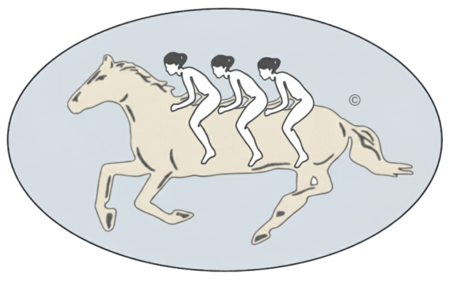
 
<a href="./README.md">English</a> | 
<a href="./README-es.md">Español</a>

# **Marco de Analítica de Producto**

Un marco sistemático para la analítica de producto. Un proceso ascendente diseñado para convertir datos crudos en aprendizajes validados que informan directamente la estrategia, las tácticas y la hoja de ruta de funcionalidades del producto.

### **Índice**

* [Introducción](introduccion)
* [Capa 1: Teoría](capa-1-teoria)
* [Capa 2: Inferencia](capa-2-inferencia)
* [Capa 3: Activación](capa-3-activacion)
* [Bucles de Retroalimentación](bucles-de-retroalimentacion)

---

## **Introducción**

Este marco es el motor analítico para la toma de decisiones de producto basadas en evidencia. Avanza desde una comprensión fundamental hacia pruebas rigurosas y, finalmente, a la implementación estratégica, organizado en tres capas principales:
> **Teoría** → **Inferencia** → **Activación**

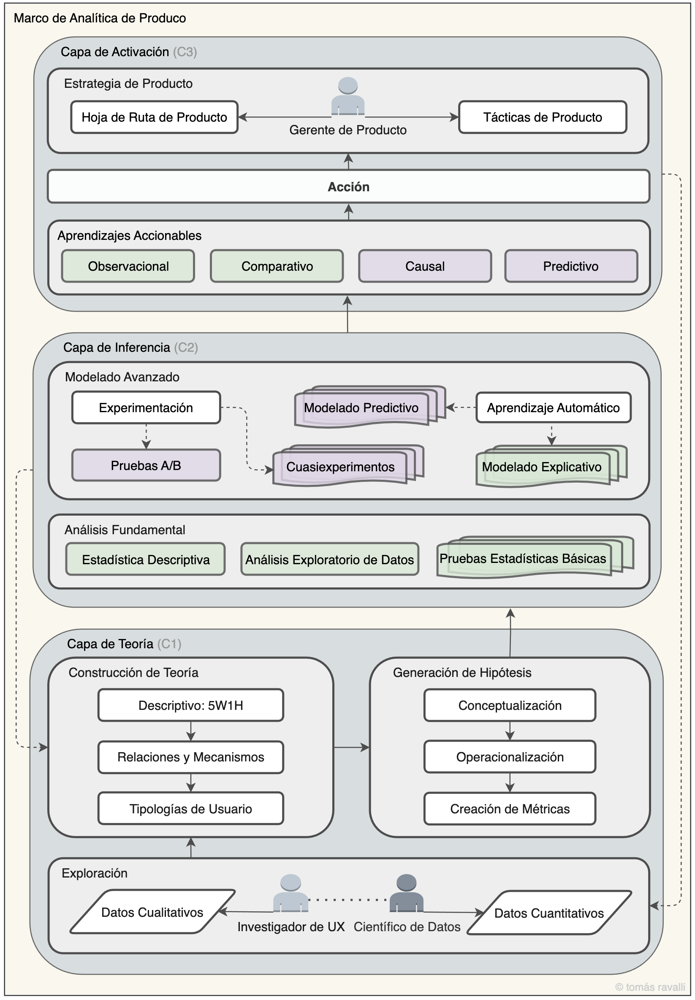
 
<em>Fig. 1: Marco de Analítica de Producto</em>

### **Roles Clave**

Si bien la analítica de producto es un esfuerzo colaborativo conjunto, este marco es impulsado por las contribuciones distintivas de cinco roles clave. Cada rol es dueño de una parte crítica del proceso, y su interacción es esencial para convertir datos en cambios de producto con impacto.

| Rol | Capa(s) Principal(es) | Contribución Principal |
| :--- | :--- | :--- |
| **Investigador de UX** | `Teoría (C1)` | Proporciona **Datos Cualitativos** realizando entrevistas a usuarios, encuestas y estudios de usabilidad para descubrir las motivaciones y puntos de dolor –el "por qué"– detrás del comportamiento del usuario. |
| **Científico de Datos de Producto** | `Teoría (C1)` e `Inferencia (C2)` | Suministra **Datos Cuantitativos** y ejecuta todos los análisis en la **Capa de Inferencia** –desde EDA hasta modelado avanzado– para generar aprendizajes validados y accionables. |
| **Ingeniero de Producto** | `Activación (C3)` y `Teoría (C1)` | Ejecuta la **Acción** construyendo y lanzando funcionalidades. También habilita el marco al ingeniar la recolección de los **Datos Cuantitativos** necesarios para el análisis. |
| **Diseñador de Producto** | `Activación (C3)` y `Teoría (C1)` | Traduce los **Aprendizajes Accionables** y la estrategia en experiencias de usuario tangibles, diseñando los wireframes, prototipos y mockups de alta fidelidad que los ingenieros construyen. |
| **Gerente de Producto** | `Activación (C3)` | Consume los **Aprendizajes Accionables** para dar forma a la **Estrategia de Producto**, definir la **Hoja de Ruta (Roadmap)** y tomar decisiones basadas en evidencia, actuando como el eje central para activar los aprendizajes. |

## **Capa 1: Teoría**

La capa fundamental donde los datos crudos se transforman en una comprensión estructurada del comportamiento del usuario. Su propósito es asegurar que se formulen las preguntas correctas y se formen teorías sólidas antes de comenzar el análisis. Esta capa sintetiza datos cualitativos y cuantitativos para construir teorías falsables e hipótesis comprobables.

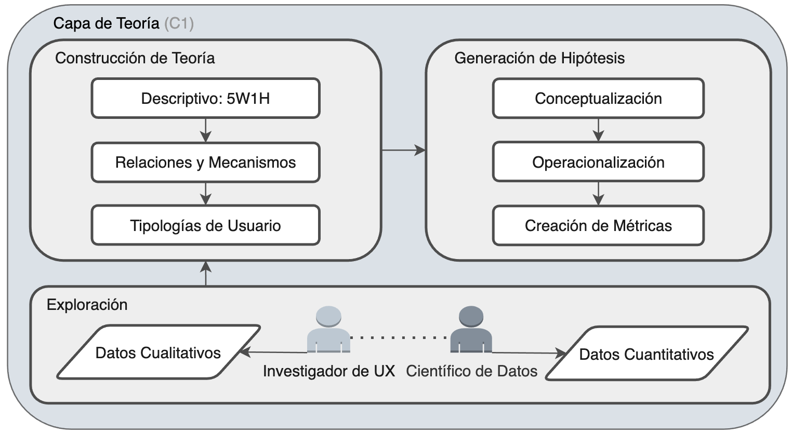
 
<em>Fig. 2: Marco de Analítica de Producto – Capa de Teoría (C1)</em>

#### **Componentes Principales:**

* **Exploración** (C1·1): El proceso de recopilar y explorar Datos Cualitativos y Datos Cuantitativos para comprender el panorama.
* **Construcción de Teoría** (C1·2): Crear modelos conceptuales y Tipologías de Usuario y Comportamiento para explicar los fenómenos observados.
* **Generación de Hipótesis** (C1·3): Traducir teorías en enunciados específicos y medibles definiendo conceptos abstractos (Conceptualización), determinando cómo medirlos (Operacionalización) y creando Métricas tangibles.

 

<strong>Clic para expandir/colapsar componentes de C1</strong>

### Exploración (C1·1)

Esta fase inicial consiste en reunir la materia prima para la construcción de la teoría. Implica una asociación entre disciplinas cualitativas y cuantitativas para obtener una visión holística de la experiencia del usuario.

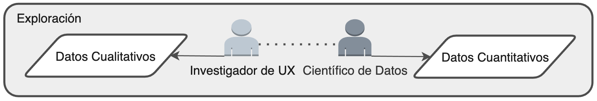
 
<em>Fig. 3: Capa de Teoría – Exploración (C1·1)</em>

| Tipo de Dato | Descripción | Fuente | Ejemplos | Propósito |
| :--- | :--- | :--- | :--- | :--- |
| **Datos Cualitativos** | Proporcionan el "por qué" detrás de las acciones del usuario. Incluyen aprendizajes de métodos que exploran motivaciones, opiniones y sentimientos. | Típicamente impulsados por Investigadores de UX. | Entrevistas a usuarios, encuestas, feedback de grupos focales, tickets de soporte, reseñas en tiendas de apps. | Comprender los objetivos, motivaciones y puntos de dolor del usuario que son vitales para explicar el comportamiento. |
| **Datos Cuantitativos** | Proporcionan el "qué" y el "cómo" del comportamiento del usuario a escala. Consisten en eventos medibles y registrados dentro del producto. | Típicamente gestionados y presentados por Científicos de Datos o Analistas. | Datos de *clickstream*, datos de sesión, historial de compras, tasas de adopción de funcionalidades y tasas de abandono. | Describir lo que los usuarios hacen en conjunto, identificar patrones y proporcionar cifras concretas para un análisis riguroso. |

### Construcción de Teoría (C1·2)

Una vez explorados los datos, el siguiente paso es sintetizarlos en un marco explicativo coherente o "modelo mental". No es solo una colección de hechos, sino una historia estructurada sobre cómo y por qué los usuarios se comportan de cierta manera. Una buena teoría es generalizable, objetiva, verificable, falsable y reproducible.

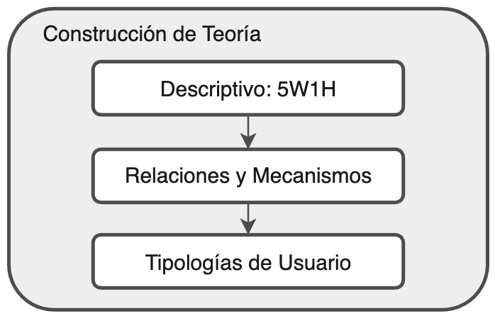
 
<em>Fig. 4: Capa de Teoría – Construcción de Teoría (C1·2)</em>

| Componente | Descripción | Ejemplo | Propósito |
| :--- | :--- | :--- | :--- |
| **Descriptivo (5W1H)** | El primer paso para formalizar la comprensión respondiendo a preguntas clave: Quién, Qué, Dónde, Cuándo, Por qué y Cómo. | ¿*Quiénes* son los usuarios más comprometidos? ¿*Qué* funcionalidades utilizan? ¿*Dónde* abandonan el embudo de usuario? | Crear una base descriptiva completa antes de intentar explicar los vínculos causales. |
| **Relaciones y Mecanismos** | Va más allá de la simple descripción para definir conexiones entre comportamientos y proponer los mecanismos que los impulsan. | Se observa una correlación positiva entre el uso de la Funcionalidad A y la retención. El *mecanismo* propuesto es que la Funcionalidad A ayuda a construir lazos sociales, aumentando los costos de cambio. | Formar el núcleo de un argumento causal que pueda ser probado más tarde. |
| **Tipologías de Usuario y Comportamiento** | La práctica de categorizar usuarios o comportamientos en grupos distintos para gestionar la complejidad y generalizar los hallazgos. | Tipología de comportamiento social. | Construir modelos más matizados que reconozcan que diferentes segmentos de usuarios tienen distintas necesidades y comportamientos. |

### Generación de Hipótesis (C1·3)

El paso final en la Capa de Teoría, donde las teorías abstractas se traducen en enunciados concretos y comprobables. Es el puente crítico entre las ideas y las pruebas empíricas.

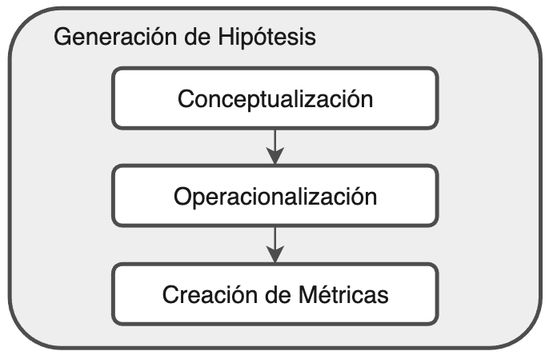
 
<em>Fig. 5: Capa de Teoría – Generación de Hipótesis (C1·3)</em>

| Proceso | Descripción | Ejemplo | Propósito |
| :--- | :--- | :--- | :--- |
| **Conceptualización** | Definir claramente ideas abstractas y a menudo intangibles como "engagement del usuario" o "adherencia del producto". | Para probar una teoría sobre el "engagement del usuario", el concepto debe definirse primero como: "El nivel de interacción activa y repetida de un usuario con las funcionalidades principales del producto". | Crear una comprensión compartida y precisa de los conceptos abstractos dentro de la teoría. |
| **Operacionalización** | Determinar cómo se puede medir un concepto definido, descomponiéndolo en sus dimensiones medibles. | *Operacionalización*: Medir el engagement a través de (1) frecuencia de visitas, (2) amplitud de funcionalidades utilizadas, y (3) profundidad de la interacción. | Crear una estrategia clara sobre cómo cuantificar una idea abstracta. |
| **Creación de Métricas** | Crear los indicadores específicos y tangibles para cada dimensión, que pueden ser diferentes tipos de variables. | *Métricas*: (1) Usuarios Activos Diarios (DAU), (2) Número de funcionalidades principales usadas por sesión, (3) Promedio de comentarios por semana. | Producir las métricas cuantificables finales que se utilizarán para probar la hipótesis. |

---

## Capa 2: Inferencia

El núcleo analítico donde las hipótesis generadas en la Capa de Teoría se prueban rigurosamente contra los datos. El objetivo principal es generar aprendizajes validados separando los hallazgos estadísticamente significativos del ruido aleatorio. Esta capa aplica los métodos estadísticos apropiados para probar hipótesis y generar uno de cuatro tipos de aprendizajes: *Observacional*, *Comparativo*, *Causal* o *Predictivo*.

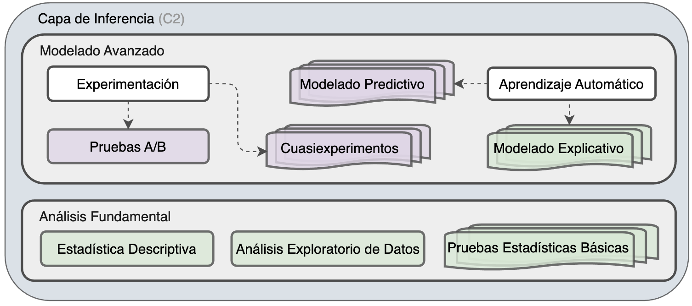
 
<em>Fig. 6: Marco de Analítica de Producto – Capa de Inferencia (C2)</em>

#### **Componentes Principales:**

* **Análisis Fundamental** (C2·1): El motor para la inteligencia de negocio diaria, usando Estadística Descriptiva, Análisis Exploratorio de Datos (EDA) y Pruebas Estadísticas Básicas para generar aprendizajes *Observacionales* y *Comparativos*.
* **Modelado Avanzado** (C2·2): El conjunto de herramientas para responder preguntas estratégicas complejas. Utiliza Experimentación (pruebas A/B), Cuasiexperimentos y modelos de Machine Learning para generar aprendizajes *Causales* y *Predictivos*.

 

<strong>Clic para expandir/colapsar componentes de C2</strong>

### Análisis Fundamental (C2·1)

Utiliza técnicas estadísticas fundamentales para describir el estado actual del producto y sus usuarios, generando aprendizajes *Observacionales* y *Comparativos*.

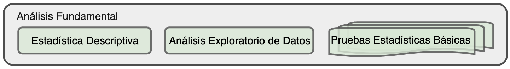
 
<em>Fig. 7: Capa de Inferencia – Análisis Fundamental (C2·1)</em>

| Método | Descripción | Propósito | Ejemplo |
| :--- | :--- | :--- | :--- |
| **Estadística Descriptiva** | Resume y describe las características principales de un conjunto de datos, proporcionando una visión cuantitativa de "lo que está sucediendo". | Condensar grandes volúmenes de datos en resúmenes simples como la media, la mediana o la varianza. | Calcular el ingreso promedio por usuario (ARPU), la mediana de sesiones por semana o la distribución de edades de los usuarios. |
| **Análisis Exploratorio de Datos (EDA)** | El proceso de visualizar datos para descubrir patrones, detectar anomalías y verificar supuestos. | Identificar relaciones entre variables y guiar la selección de modelos estadísticos apropiados. | Crear un histograma de la duración de las sesiones para ver si la distribución es normal o exponencial, o un gráfico de dispersión para visualizar relaciones. |
| **Pruebas Estadísticas Básicas** | Se utilizan para hacer inferencias sobre una población a partir de una muestra, determinando si las diferencias observadas son estadísticamente significativas. | Validar hipótesis comparativas. | Usar una **prueba t** para comparar el gasto promedio entre dos grupos de usuarios, o una **prueba de chi-cuadrado** para comparar tasas de conversión. |

### Modelado Avanzado (C2·2)

Utiliza técnicas más sofisticadas para comprender la causalidad y predecir el comportamiento futuro, generando aprendizajes *Causales* y *Predictivos*.

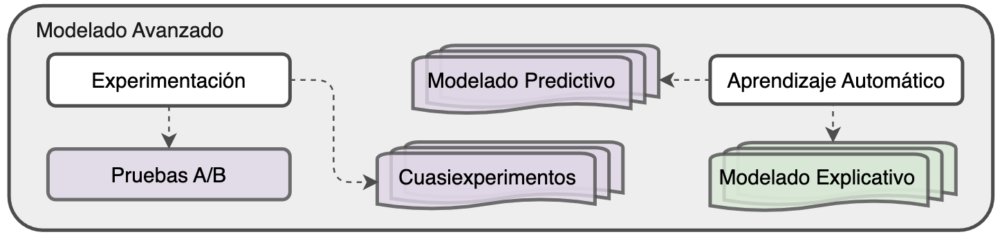
 
<em>Fig. 8: Capa de Inferencia – Modelado Avanzado (C2·2)</em>

| Método | Descripción | Propósito | Ejemplo |
| :--- | :--- | :--- | :--- |
| **Experimentación (Pruebas A/B)** | El estándar de oro para establecer relaciones causales asignando aleatoriamente a los usuarios a grupos de control y tratamiento. | Aislar el efecto causal de una sola variable (p. ej., una nueva funcionalidad) en una métrica clave. | Mostrar aleatoriamente un botón verde al 50% de los usuarios y uno azul al otro 50% para determinar qué color *causa* una mayor tasa de clics. |
| **Cuasiexperimentos** | Métodos para estimar efectos causales cuando la aleatorización real no es factible, aprovechando circunstancias naturales. | Inferir causalidad a partir de datos observacionales controlando el sesgo de selección. | **Diferencia en Diferencias (DiD)**, **Regresión Discontinua (RD)**, o **Emparejamiento Estadístico (Statistical Matching)**. |
| **Modelado Predictivo**| Usar algoritmos para aprender patrones de datos históricos y hacer pronósticos sobre eventos futuros. Se centra en la correlación, no en la causalidad. | Predecir el comportamiento del usuario, como el riesgo de abandono (churn), el valor de vida del cliente (LTV) o la probabilidad de adoptar una nueva funcionalidad. | Construir un modelo de regresión logística para predecir la probabilidad de que un nuevo usuario abandone en sus primeros 30 días. |
| **Modelado Explicativo** | Cierra la brecha entre el análisis predictivo y causal, explicando *por qué* ocurrió un resultado o *qué* usuarios son los más afectados. | Entender los efectos heterogéneos del tratamiento (cómo un cambio impacta de manera diferente a distintos segmentos de usuarios). | Usar **Modelado de Uplift** para identificar a los usuarios cuyo comportamiento es más propenso a cambiar por un mensaje de marketing. |

---

## **Capa 3: Activación**

Esta es la capa final y más crítica, donde los aprendizajes analíticos se traducen en acciones tangibles de negocio y producto. El objetivo es asegurar que el trabajo riguroso de las capas de Teoría e Inferencia conduzca a mejoras significativas del producto y a la alineación estratégica.

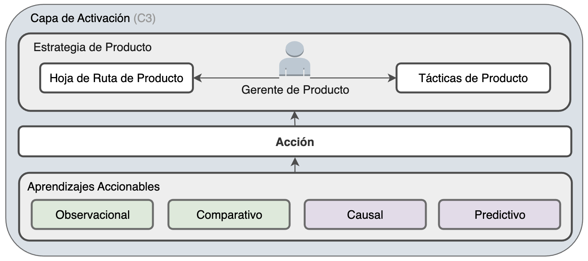
 
<em>Fig. 9: Marco de Analítica de Producto – Capa de Activación (C3)</em>

#### **Componentes Principales:**

* **Aprendizajes Accionables** (C3·1): Los resultados validados de la Capa de Inferencia, categorizados como *Observacionales*, *Comparativos*, *Causales* o *Predictivos*.
* **Acción** (C3·2): La implementación concreta de un aprendizaje (p. ej., lanzar una funcionalidad, cambiar un flujo de usuario).
* **Estrategia de Producto** (C3·3): La influencia estratégica de los aprendizajes en la Estrategia de Producto, la Hoja de Ruta (Roadmap) y las Tácticas gestionadas por el equipo de producto.

 

<strong>Clic para expandir/colapsar componentes de C3</strong>

### Aprendizajes Accionables (C3·1)

Este componente representa los resultados validados y de alta confianza de la Capa de Inferencia. Un aprendizaje se considera "accionable" cuando puede usarse para impulsar un cambio específico en el producto. Estos aprendizajes son el combustible para la Capa de Activación.

 
<em>Fig. 10: Capa de Activación – Aprendizajes Accionables (C3·1)</em>

| Tipo de aprendizaje | Descripción | Resultado Típico |
| :--- | :--- | :--- |
| **Observacional** | Basado en la descripción de un fenómeno. | Conduce a mejoras tácticas (p. ej., "Los usuarios pasan más tiempo en la funcionalidad *X*, mejoremos su diseño"). |
| **Comparativo** | Relacionado con una comparación entre dos o más grupos. | Impulsa una mayor investigación causal (p. ej., "Los usuarios de *X* retienen mejor que los de *Y*, averigüemos por qué"). |
| **Causal** | Identifica una relación de causa y efecto. | Informa directamente las decisiones sobre funcionalidades o campañas (p. ej., "El Banner A *causa* más registros que el Banner B, usemos el Banner A"). |
| **Predictivo** | Relacionado con la previsión de eventos futuros. | crucial para la planificación estratégica y la asignación de recursos (p. ej., "Necesitaremos 5 veces más capacidad de servidor para el Q4"). |

### Acción (C3·2)

Una **Acción** es la implementación concreta de un aprendizaje. Es el puente entre el mundo analítico y el producto en vivo. El éxito de todo el marco depende de la capacidad de traducir eficazmente los aprendizajes en acciones bien ejecutadas.

 
<em>Fig. 11: Capa de Activación – Acción (C3·2)</em>

| Componente | Descripción |
| :--- | :--- |
| **Propósito** | Cambiar algún aspecto de la experiencia del usuario, la funcionalidad del producto o el proceso de negocio con el objetivo de mejorar las métricas clave. |
| **Ejemplos** | <ul><li>**aprendizaje Causal:** Una prueba A/B demuestra que un formulario de registro simplificado aumenta la conversión en un 15%. → **Acción:** Lanzar el nuevo formulario al 100% de los usuarios.</li><li>**aprendizaje Observacional:** Un análisis del embudo de usuario muestra una caída del 60% en la pantalla de pago. → **Acción:** Priorizar un rediseño de la pantalla de pago.</li><li>**aprendizaje Predictivo:** Un modelo de churn identifica un segmento de usuarios en riesgo. → **Acción:** Lanzar una campaña de re-engagement dirigida a ese segmento.</li></ul> |

### Estrategia de Producto (C3·3)

Las acciones tomadas a partir de aprendizajes influyen y dan forma directamente a la dirección del producto en todos los niveles, desde la visión de alto nivel hasta la ejecución diaria. Este componente asegura que el producto evolucione basado en evidencia en lugar de solo en la intuición.

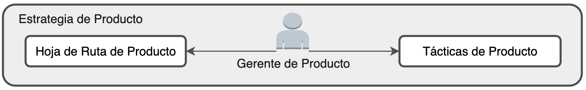
 
<em>Fig. 12: Capa de Activación – Estrategia de Producto (C3·3)</em>

| Artefacto Estratégico | Descripción | Impacto de los aprendizajes |
| :--- | :--- | :--- |
| **Estrategia de Producto** | El plan de alto nivel para alcanzar la visión del producto. | Los aprendizajes validan o desafían los supuestos centrales de la estrategia, pudiendo llevar a pivotes importantes. |
| **Hoja de Ruta (Roadmap)** | El plan temporal de qué funcionalidades e iniciativas se construirán. | Los aprendizajes proporcionan la evidencia necesaria para priorizar una funcionalidad sobre otra, enfocando los recursos en el trabajo de mayor impacto. |
| **Tácticas de Producto** | Las decisiones a menor escala, a menudo a corto plazo, para alcanzar los objetivos de la hoja de ruta. | Un aprendizaje puede conducir directamente a un cambio táctico en un flujo de usuario, el texto de la interfaz o la temporización de una notificación. |

---

## Bucles de Retroalimentación

El marco no es un proceso lineal, sino un ciclo dinámico. A continuación se presentan dos bucles de retroalimentación clave que impulsan su aprendizaje y adaptación continuos:

### **1. El Macro-Ciclo**
`Capa de Activación` → `Exploración`

Este es el motor principal del desarrollo de productos, impulsando la evolución iterativa del producto en sí.

* **Qué:** Cada **Acción** tomada en la Capa de Activación (p. ej., lanzar una funcionalidad) genera nuevos datos cuantitativos (datos de uso) y cualitativos (feedback de usuario). Esta nueva información se convierte en la materia prima para el siguiente ciclo de **Exploración**.
* **Por qué:** Para asegurar que los resultados del mundo real de cada acción informen la siguiente ronda de análisis y planificación estratégica.

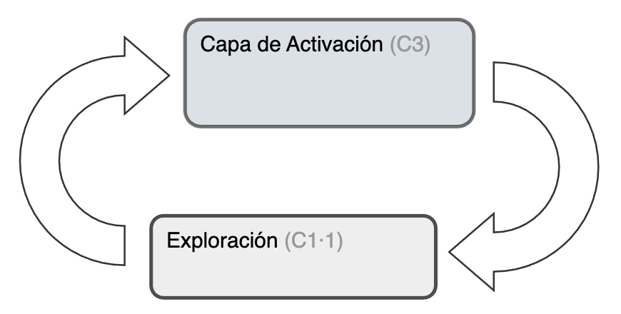
 
<em>Fig. 13: El Bucle de Retroalimentación del Macro-Ciclo</em>

### **2. El Ciclo de Refinamiento de la Teoría**
`Capa de Inferencia` → `Construcción de Teoría`

Este bucle asegura que la comprensión del equipo sobre sus usuarios se actualice constantemente con evidencia rigurosa, haciendo que la teoría fundamental sea más precisa con el tiempo.

* **Qué:** Los aprendizajes validados de la **Capa de Inferencia** se utilizan para desafiar y refinar los modelos conceptuales en la fase de **Construcción de Teoría**. Un hallazgo que contradice una hipótesis indica que la teoría subyacente necesita revisión.
* **Por qué:** Para hacer que el marco se autocorrija forzando una reevaluación disciplinada de los supuestos basada en los resultados analíticos.

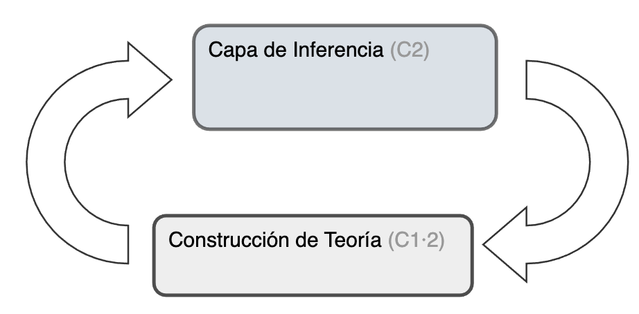
 
<em>Fig. 14: El Bucle de Retroalimentación de Refinamiento de la Teoría</em>

 

> **Referencias**
> * Rodrigues, J. (2021). *Product Analytics: Applied Data Science Techniques for Actionable Consumer aprendizajes*. Addison-Wesley.
> * Croll, A., & Yoskovitz, B. (2013). *Lean Analytics: Use Data to Build a Better Startup Faster*. O'Reilly Media.
> * Meadows, D. H. (2008). *Thinking in Systems: A Primer*. Chelsea Green Publishing.

 

🌐 © 2025 t.r.

