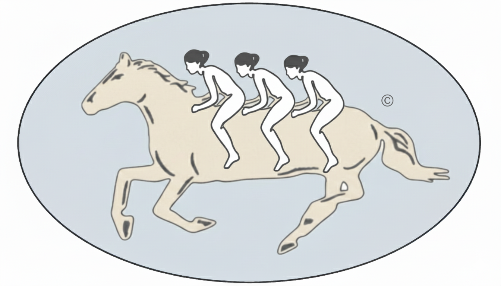
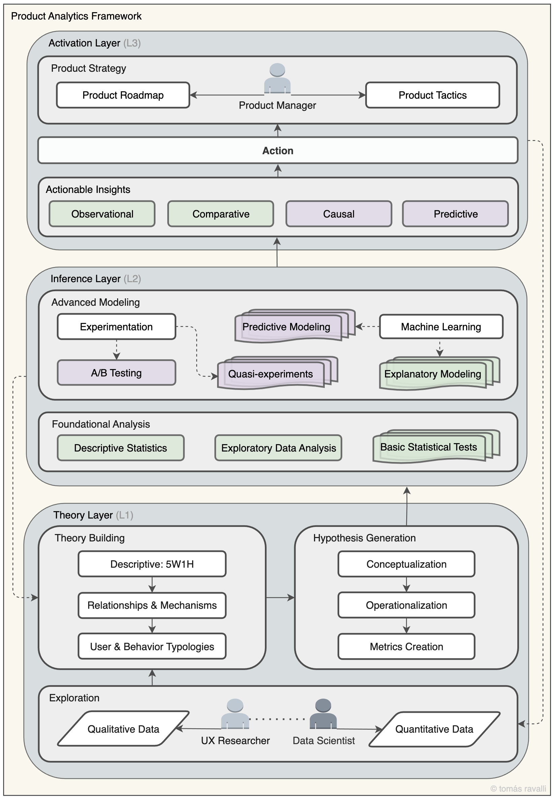
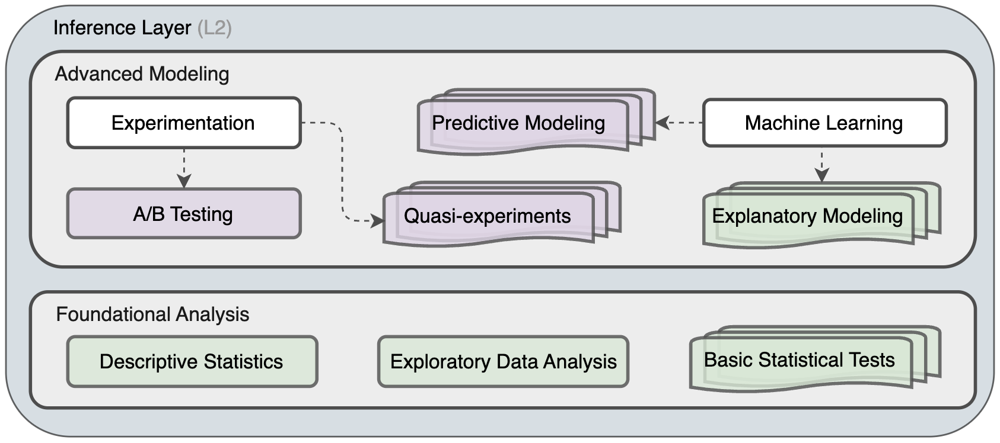

  
   
  <a href="./README.md">English</a> |
  <a href="./README-es.md">Español</a>

# **Product Analytics Framework**

  
  
  

This repository outlines a systematic framework for product analytics. It's a bottom-up process designed to convert raw data into validated insights that directly inform product strategy, tactics, and the feature roadmap. The framework is organized into three core layers: 
> **Theory** → **Inference** → **Activation**

### **Outline**

* [Framework Overview](framework-overview)
* [Layer 1: Theory](layer-1-theory)
* [Layer 2: Inference](layer-2-inference)
* [Layer 3: Activation](layer-3-activation)
* [Feedback Loops](feedback-loops)

---

## **Framework Overview**

This framework is the analytical engine for evidence-based product decisions. It moves from foundational understanding to rigorous testing and finally to strategic implementation.

  
   
  <em>Fig. 1: Product Analytics Framework</em>

---

## **Layer 1: Theory**

This is the foundational layer where we move from raw data to a structured understanding of user behavior. Its purpose is to ensure we ask the right questions and form solid theories before jumping to analysis. This layer synthesizes qualitative and quantitative data to build falsifiable theories and testable hypotheses.

  
   
  <em>Fig. 2: Theory Layer (L1)</em>

#### **Main Components:**

* **Exploration** (L1·1): The process of gathering and exploring Qualitative Data (interviews, surveys) and Quantitative Data (event logs, metrics) to understand the landscape.  
* **Theory Building** (L1·2): Creating conceptual models and User & Behavior Typologies to explain observed phenomena (e.g., "Our users are either 'Explorers' or 'Settlers'").  
* **Hypothesis Generation** (L1·3): Translating theories into specific, measurable statements by defining abstract concepts (Conceptualization), determining how to measure them (Operationalization), and creating tangible Metrics.

### Exploration (L1·1) 

This initial phase is about gathering the raw materials for theory building. It involves a partnership between qualitative and quantitative disciplines to get a holistic view of the user experience.

| Data Type | Description | Source | Examples | Purpose |
| :--- | :--- | :--- | :--- | :--- |
| **Qualitative Data** | Provides the "why" behind user actions. It includes insights gathered from methods that explore user motivations, opinions, and feelings. | Typically driven by UX Researchers. | User interviews, surveys, focus group feedback, support tickets, app store reviews. | To understand user goals, motivations, and pain points that are vital for explaining behavior. |
| **Quantitative Data** | Provides the "what" and "how" of user behavior at scale. It consists of measurable, logged events within the product. | Typically managed and surfaced by Data Scientists or Analysts. | Clickstream data, user session data, purchase history, feature adoption rates, and churn rates. | To describe what users are doing in aggregate, identify patterns, and provide hard numbers for rigorous analysis. |

### Theory Building (L1·2)

Once data is explored, the next step is to synthesize it into a coherent, explanatory framework or "mental model". This is not just a collection of facts, but a structured story about how and why users behave the way they do. A good theory is generalizable, objective, verifiable, falsifiable, and reproducible.

| Component | Description | Example | Purpose |
| :--- | :--- | :--- | :--- |
| **Descriptive (5W1H)** | The first step in formalizing understanding by answering the core journalistic questions: Who, What, Where, When, Why, and How. | *Who* are our most engaged users? *What* features do they use? *Where* in the user funnel do they drop off? | To create a comprehensive, descriptive foundation before attempting to explain causal links. |
| **Relationships & Mechanisms** | Moves beyond simple description to define connections between behaviors and propose the mechanisms driving them. | We observe a positive correlation between Feature A usage and retention. The proposed *mechanism* is that Feature A builds social ties, increasing switching costs. | To form the core of a causal argument that can be tested later. |
| **User & Behavior Typologies** | The practice of categorizing users or behaviors into distinct groups to manage complexity and generalize findings. | "Whales and wallflowers" model; Social behavior typology (Active/Passive & Incoming/Outgoing). | To build more nuanced models that recognize different user segments have different needs and behaviors. |

### Hypothesis Generation (L1·3) 

This is the final step in the Theory Layer, where abstract theories are translated into concrete, testable statements. It’s the critical bridge between ideas and empirical testing.

| Process | Description | Example | Purpose |
| :--- | :--- | :--- | :--- |
| **Conceptualization** | Clearly defining abstract, often intangible, ideas like "user engagement" or "product stickiness". | *Conceptualization*: "User engagement is a user's level of active and repeated interaction with core product features." | To create a shared and precise understanding of the abstract concepts in our theory. |
| **Operationalization** | Determining how a defined concept can be measured by breaking it into its measurable dimensions. | *Operationalization*: Measuring engagement via (1) frequency of visits, (2) breadth of features used, and (3) depth of interaction. | To create a clear strategy for how to quantify an abstract idea. |
| **Metrics Creation** | Creating the specific, tangible indicators for each dimension, which can be different types of variables (real-valued, ordinal, etc.). | *Metrics*: (1) Daily Active Users (DAU), (2) Number of core features used per session, (3) Average comments per week. | To produce the final, quantifiable metrics that will be used to test the hypothesis. |

This structured process ensures that by the time we exit the Theory Layer, we have a clear, testable hypothesis grounded in both qualitative and quantitative exploration, ready for the rigor of the Inference Layer.

---

## Layer 2: Inference

This is the analytical core where hypotheses generated in the Theory Layer are rigorously tested against data. The primary goal is to generate validated insights by separating statistically significant findings from random noise. This layer applies the appropriate statistical methods to test hypotheses and generate one of four types of insights: Observational, Comparative, Causal, or Predictive.

  
   
  <em>Fig. 3: Inference Layer (L2)</em>

#### **Main Components:**

* **Foundational Analysis** (L2·1): The engine for day-to-day business intelligence, using Descriptive Statistics, Exploratory Data Analysis (EDA), and Basic Statistical Tests to generate **Observational** and **Comparative** insights.  
* **Advanced Modeling** (L2·2): The toolkit for answering complex strategic questions. It uses Experimentation (A/B tests), Quasi-experiments, and Machine Learning models to generate **Causal** and **Predictive** insights.

### Foundational Analysis (L2·1)

This is the engine for day-to-day business intelligence and hypothesis validation. It uses fundamental statistical techniques to describe the current state of the product and its users, generating **Observational** and **Comparative** insights.

| Method | Description | Purpose | Example |
| :--- | :--- | :--- | :--- |
| **Descriptive Statistics** | Summarizes and describes the main features of a dataset, providing a quantitative overview of "what is happening". | To condense large volumes of data into simple summaries like the mean, median, or variance. | Calculating the average revenue per user (ARPU), the median number of sessions per week, or the distribution of user ages. |
| **Exploratory Data Analysis (EDA)** | The process of visualizing data to discover patterns, spot anomalies, and check assumptions. | To identify relationships between variables and guide the selection of appropriate statistical models. | Creating a histogram of session durations to see if the distribution is normal or exponential, or a scatter plot to visualize relationships. |
| **Basic Statistical Tests** | Used to make inferences about a population from a sample, determining if observed differences are statistically significant. | To validate comparative hypotheses. | Using a **t-test** to compare average spend between two user groups, or a **chi-squared test** to compare conversion rates. |

### Advanced Modeling (L2·2)

This is the toolkit for answering complex strategic questions that go beyond simple description. It uses more sophisticated techniques to understand causality and predict future behavior, generating **Causal** and **Predictive** insights.

| Method | Description | Purpose | Example |
| :--- | :--- | :--- | :--- |
| **Experimentation (A/B Testing)** | The gold standard for establishing causal relationships by randomly assigning users to control and treatment groups. | To isolate the causal effect of a single variable (e.g., a new feature) on a key metric. | Randomly showing 50% of users a green button and 50% a blue one to determine which color *causes* a higher click-through rate. |
| **Quasi-experiments** | Methods used to estimate causal effects when true randomization isn't feasible, leveraging naturally occurring circumstances. | To infer causality from observational data by controlling for selection bias. | **Difference-in-Difference (DiD)**, **Regression Discontinuity (RD)**, or **Statistical Matching**. |
| **Predictive Modeling / Machine Learning** | Using algorithms to learn patterns from historical data to make forecasts about future events. This is focused on correlation, not causation. | To predict user behavior, such as churn risk, lifetime value, or the likelihood of adopting a new feature. | Building a logistic regression model to predict the probability that a new user will churn within their first 30 days. |
| **Explanatory Modeling** | Bridges the gap between predictive and causal analysis, explaining *why* an outcome occurred or *which* users are most affected. | To understand heterogeneous treatment effects (how a change impacts different user segments differently). | Using **Uplift Modeling** to identify "persuadable" users whose behavior is most likely to be changed by a marketing message. |

---

## **Layer 3: Activation**

This is the final and most critical layer, where analytical insights are translated into tangible business and product actions. The goal of this layer is to ensure that the rigorous work done in the Theory and Inference layers leads to meaningful product improvements and strategic alignment. This is where data-informed becomes data-driven.

  
   
  <em>Fig. 4: Activation Layer (L3)</em>

#### **Main Components:**

* **Actionable Insights** (L3·1): The validated outputs from the Inference Layer, categorized as Observational, Comparative, Causal, or Predictive.  
* **Action** (L3·2): The concrete implementation of an insight (e.g., shipping a feature, changing a user flow).  
* **Strategic Influence** (L3·3): The direct impact of insights on the Product Strategy, Roadmap, and Tactics managed by the Product team.

### Actionable Insights (L3·1)

This component represents the validated, high-confidence outputs from the Inference Layer. An insight is considered "actionable" when it can be used to drive a specific change in the product or organization. These insights are the fuel for the Activation Layer.

| Insight Type | Description | Typical Outcome |
| :--- | :--- | :--- |
| **Observational** | Based on the description of a phenomenon. | Leads to tactical improvements (e.g., "Users spend the most time on the homepage, let's improve its design"). |
| **Comparative** | Related to a comparison between two or more groups. | Prompts further causal investigation (e.g., "Google users retain better than Facebook users, let's find out why"). |
| **Causal** | Identifies a cause-and-effect relationship. | Directly informs feature or campaign decisions (e.g., "Banner A *causes* more signups than Banner B, let's use Banner A"). |
| **Predictive** | Related to forecasting future events. | Crucial for strategic planning and resource allocation (e.g., "We will need 5x server capacity by Q4"). |

### Action (L3·2)

An **Action** is the concrete implementation of an insight. It is the bridge between the analytical world and the live product. The success of the entire framework hinges on the ability to effectively translate insights into well-executed actions.

| Component | Description |
| :--- | :--- |
| **Purpose** | To change some aspect of the user experience, product functionality, or business process with the goal of improving key metrics. |
| **Examples** | <ul><li>**Causal Insight:** An A/B test proves a simplified sign-up form increases conversion by 15%. → **Action:** Ship the new form to 100% of users.</li><li>**Observational Insight:** A user funnel analysis shows a 60% drop-off on the payment screen. → **Action:** Prioritize a redesign of the payment screen.</li><li>**Predictive Insight:** A churn model identifies a segment of at-risk users. → **Action:** Launch a targeted re-engagement campaign for that segment.</li></ul> |

### Strategic Influence (L3·3)

The actions taken based on insights directly influence and shape the product's direction at all levels, from high-level vision to day-to-day execution. This component ensures that the product evolves based on evidence rather than solely on intuition.

| Strategic Artifact | Description | Impact of Insights |
| :--- | :--- | :--- |
| **Product Strategy** | The high-level plan for achieving the product's vision. | Insights validate or challenge the core assumptions of the strategy, potentially leading to major pivots. |
| **Product Roadmap** | The time-based plan for what features and initiatives will be built. | Insights provide the evidence needed to prioritize one feature over another, focusing resources on the highest-impact work. |
| **Product Tactics** | The smaller-scale, often short-term decisions made to achieve the roadmap's goals. | An insight can directly lead to a tactical change in a user flow, UI copy, or notification timing. |

---

## Feedback Loops

The Product Analytics Framework is not a linear, one-time process. It is a dynamic and iterative system designed for continuous learning and adaptation. Its power comes from the three feedback loops that connect the layers, ensuring that product decisions become progressively smarter over time.

  
   
  <em>Fig. 5: The Three Feedback Loops of the Framework</em>

| Loop | Type | Description | Purpose |
| :--- | :--- | :--- | :--- |
| **1. The Macro-Cycle** 🔄 | `Activation → Theory` | Every **Action** (e.g., shipping a feature) generates new data and user feedback, which becomes the raw material for a new cycle of **Exploration**. | Drives the iterative evolution of the product by ensuring that real-world outcomes inform the next round of strategic and tactical planning. |
| **2. The Analytical Cycle** 🔬 | `Advanced → Foundational` | Findings from **Advanced Models** (e.g., an ML model) raise new descriptive questions that are investigated using **Foundational Analysis** (e.g., EDA). | Deepens analytical understanding by ensuring complex findings are grounded in a solid descriptive context, preventing insights from being interpreted in a vacuum. |
| **3. The Theory Refinement Cycle** 🤔 | `Hypothesis → Theory` | When a key **Hypothesis** is invalidated by testing, it forces a return to **Theory Building** to revise the underlying conceptual models and assumptions. | Makes the framework self-correcting by forcing a disciplined re-evaluation of assumptions, ensuring the team's "mental model" of the user becomes more accurate. |

 

> ### **References**
> * Rodrigues, J. (2021). *Product Analytics: Applied Data Science Techniques for Actionable Consumer Insights*. Addison-Wesley.
> * Croll, A., & Yoskovitz, B. (2013). *Lean Analytics: Use Data to Build a Better Startup Faster*. O'Reilly Media.
> * Meadows, D. H. (2008). *Thinking in Systems: A Primer*. Chelsea Green Publishing.

 

🌐 © 2025 t.r.

