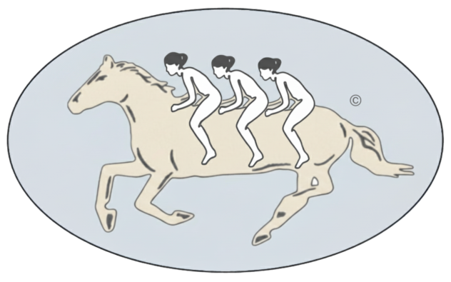

  
   

# **Product Analytics Framework**

This repository outlines a systematic framework for product analytics. It's a bottom-up process designed to convert raw data into validated insights that directly inform product strategy, tactics, and the feature roadmap.

The framework is organized into three core layers: **Theory** → **Inference** → **Activation**

### **Outline**

* [Framework Overview](framework-overview)  
* [Layer 1: Theory](layer-1-theory)  
* [Layer 2: Inference](layer-2-inference)  
* [Layer 3: Activation](layer-3-activation)  
* [References](references)

---

## **Framework Overview**

This framework is the analytical engine for evidence-based product decisions. It moves from foundational understanding to rigorous testing and finally to strategic implementation.

  
   
  <em>Fig. 1: Product Analytics Framework</em>

## **Layer 1: Theory**

This is the foundational layer where we move from raw data to a structured understanding of user behavior. Its purpose is to ensure we ask the right questions and form solid theories before jumping to analysis.
This is the "detective work" phase. We gather clues (both stories and numbers) to form a theory about what's happening and why, before we try to prove it.
This layer synthesizes qualitative and quantitative data to build falsifiable theories and testable hypotheses. It involves a clear progression from unstructured data to measurable concepts.
This is the foundational layer where we move from raw data to a structured understanding of user behavior. Its purpose is to ensure we ask the right questions and form solid theories before jumping to analysis. This layer synthesizes qualitative and quantitative data to build falsifiable theories and testable hypotheses.

  
   
  <em>Fig. 2: Theory Layer (L1)</em>

### **Main Components:**

* **Exploration:** The process of gathering and exploring Qualitative Data (interviews, surveys) and Quantitative Data (event logs, metrics) to understand the landscape.  
* **Theory Building:** Creating conceptual models and User & Behavior Typologies to explain observed phenomena (e.g., "Our users are either 'Explorers' or 'Settlers'").  
* **Hypothesis Generation:** Translating theories into specific, measurable statements by defining abstract concepts (Conceptualization), determining how to measure them (Operationalization), and creating tangible Metrics.

### **Exploration**

This initial phase is about gathering the raw materials for theory building. It involves a partnership between qualitative and quantitative disciplines to get a holistic view of the user experience.

* **Qualitative Data:** This provides the "why" behind user actions. It includes insights gathered from methods that explore user motivations, opinions, and feelings, which are often not captured in event logs.
    * **Source:** Typically driven by UX Researchers.
    * **Examples:** User interviews, surveys, focus group feedback, support tickets, app store reviews.
    * **Purpose:** To understand user goals, motivations, and pain points that are vital for explaining behavior but often left out of quantitative analyses.

* **Quantitative Data:** This provides the "what" and "how" of user behavior at scale. It consists of measurable, logged events within the product.
    * **Source:** Typically managed and surfaced by Data Scientists or Analysts.
    * **Examples:** Clickstream data (the path of clicks a user takes) , user session data, purchase history, feature adoption rates, and churn rates.
    * **Purpose:** To describe what users are doing in aggregate, identify patterns, and provide the hard numbers needed for rigorous analysis.

### **Theory Building**

Once data is explored, the next step is to synthesize it into a coherent, explanatory framework or "mental model". This is not just a collection of facts, but a structured story about how and why users behave the way they do. A good theory is generalizable, objective, verifiable, falsifiable, and reproducible.

* **Descriptive (5W1H):** This is the first step in formalizing understanding by answering the core journalistic questions: Who, What, Where, When, Why, and How.
    * **Example:** *Who* are our most engaged users? *What* features do they use? *When* during the day are they most active? *Where* in the user funnel do they drop off? *How* do they navigate from the homepage to a key feature? *Why* do we believe they are taking this path?
    * **Purpose:** To create a comprehensive, descriptive foundation before attempting to explain causal links.

* **Relationships & Mechanisms:** This involves moving beyond simple description to define connections between different behaviors and propose the mechanisms driving them. A mechanism explains *how* a cause leads to an effect.
    * **Example:** We observe that users who use Feature A are retained longer. A *relationship* is the positive correlation. The proposed *mechanism* could be that Feature A helps users build a social network, and those social ties create a high switching cost, thus improving retention.
    * **Purpose:** To form the core of a causal argument that can be tested later.

* **User & Behavior Typologies:** This is the practice of categorizing users or behaviors into distinct groups to manage complexity and generalize findings. Instead of treating all users as a monolith, we segment them into meaningful archetypes.
    * **Example:** The book describes a social behavior typology that breaks interactions into four types: Active Outgoing (e.g., sending a message), Passive Outgoing (e.g., viewing a profile), Active Incoming (e.g., receiving a like), and Passive Incoming (e.g., having your post read)[cite: 345, 346, 347]. Another example is the "whales and wallflowers" model, where a small number of users create most of the content (whales) while the majority passively consumes it (wallflowers).
    * **Purpose:** To build more nuanced models that recognize different user segments have different needs and behaviors.

### **Hypothesis Generation**

This is the final step in the Theory Layer, where abstract theories are translated into concrete, testable statements. It’s the critical bridge between ideas and empirical testing. This process follows a clear sequence:

* **Conceptualization:** The process of clearly defining abstract, often intangible, ideas. Many important product concepts like "user engagement," "product stickiness," or "user delight" are abstract and must be defined before they can be measured.
    * **Example:** To test a theory about "user engagement," we must first define it. *Conceptualization*: "User engagement is a user's level of active and repeated interaction with core product features.".
    * **Purpose:** To create a shared and precise understanding of the abstract concepts in our theory.

* **Operationalization:** The process of determining how a defined concept can be measured. It breaks a single concept into its measurable dimensions.
    * **Example:** Following the engagement concept, *Operationalization* would involve deciding which dimensions to measure: (1) frequency of visits, (2) breadth of features used, and (3) depth of interaction with a key feature.
    * **Purpose:** To create a clear strategy for how to quantify an abstract idea.

* **Metrics Creation:** The final step is creating the specific, tangible indicators for each dimension. These can be different types of variables, such as real-valued (e.g., time on site), ordinal (e.g., user satisfaction rating from 1-5), or nominal (e.g., user segment).
    * **Example:** For the engagement dimensions above, *Metrics* would be: (1) Daily Active Users (DAU), (2) Number of core features used per session, and (3) Average number of comments per user per week.
    * **Purpose:** To produce the final, quantifiable metrics that will be used to test the hypothesis.

This structured process ensures that by the time we exit the Theory Layer, we have a clear, testable hypothesis grounded in both qualitative and quantitative exploration, ready for the rigor of the Inference Layer.

## **Layer 2: Inference**

This is the analytical core where hypotheses are rigorously tested against data. The goal is to generate validated insights by separating statistically significant findings from random noise.
This is where we put our theories to the test with data. We run analyses and experiments to get proven facts that we can confidently act on.
This layer involves applying the appropriate statistical methods to test hypotheses. The choice of method depends on the type of insight required.

  
   
  <em>Fig. 3: Inference Layer (L2)</em>

### **Main Components:**

* **Foundational Analysis:** The engine for day-to-day business intelligence, using Descriptive Statistics, Exploratory Data Analysis (EDA), and Basic Statistical Tests to generate **Observational** and **Comparative** insights.  
* **Advanced Modeling:** The toolkit for answering complex strategic questions. It uses Experimentation (A/B tests), Quasi-experiments, and Machine Learning models to generate **Causal** and **Predictive** insights.

## **Layer 3: Activation**

This is the final and most critical layer, where analytical insights are translated into tangible business and product actions.
This is where the proven facts from our analysis lead to real changes: building new features, improving the user experience, and shaping the overall plan for the product.
This layer focuses on the translation of validated insights into strategic artifacts and tactical execution. The crucial feedback loop shows that the outcomes of these actions become the input for a new cycle of theoretical evaluation.

  
   
  <em>Fig. 4: Activation Layer (L3)</em>

### **Main Components:**

* **Actionable Insights:** The validated outputs from the Inference Layer, categorized as Observational, Comparative, Causal, or Predictive.  
* **Action:** The concrete implementation of an insight (e.g., shipping a feature, changing a user flow).  
* **Strategic Influence:** The direct impact of insights on the Product Strategy, Roadmap, and Tactics managed by the Product team.

 

> ### **References**
> - *Product Analytics: Applied Data Science Techniques for Actionable Consumer Insights* by Joanne Rodrigues.
> - Lean Analytics
> - Thinking in Systems

 

🌐 © 2025 t.r.

