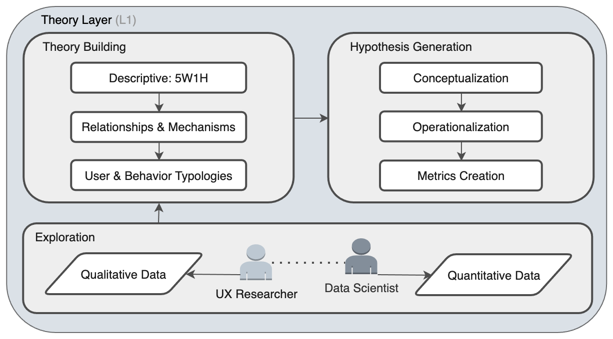

  
   

# **Product Analytics Framework**

This repository outlines a systematic framework for product analytics. It's a bottom-up process designed to convert raw data into validated insights that directly inform product strategy, tactics, and the feature roadmap.

The framework is organized into three core layers: **Theory** → **Inference** → **Activation**

### **Outline**

* [Framework Overview](framework-overview)
* [Layer 1: Theory](layer-1-theory)
* [Layer 2: Inference](layer-2-inference)
* [Layer 3: Activation](layer-3-activation)
* [Feedback Loops](feedback-loops)
* [References](references)

---

## **Framework Overview**

This framework is the analytical engine for evidence-based product decisions. It moves from foundational understanding to rigorous testing and finally to strategic implementation.

  
   
  <em>Fig. 1: Product Analytics Framework</em>

## **Layer 1: Theory**

This is the foundational layer where we move from raw data to a structured understanding of user behavior. Its purpose is to ensure we ask the right questions and form solid theories before jumping to analysis.
This is the "detective work" phase. We gather clues (both stories and numbers) to form a theory about what's happening and why, before we try to prove it.
This layer synthesizes qualitative and quantitative data to build falsifiable theories and testable hypotheses. It involves a clear progression from unstructured data to measurable concepts.
This is the foundational layer where we move from raw data to a structured understanding of user behavior. Its purpose is to ensure we ask the right questions and form solid theories before jumping to analysis. This layer synthesizes qualitative and quantitative data to build falsifiable theories and testable hypotheses.

  
   
  <em>Fig. 2: Theory Layer (L1)</em>

### **Main Components:**

* **Exploration:** The process of gathering and exploring Qualitative Data (interviews, surveys) and Quantitative Data (event logs, metrics) to understand the landscape.  
* **Theory Building:** Creating conceptual models and User & Behavior Typologies to explain observed phenomena (e.g., "Our users are either 'Explorers' or 'Settlers'").  
* **Hypothesis Generation:** Translating theories into specific, measurable statements by defining abstract concepts (Conceptualization), determining how to measure them (Operationalization), and creating tangible Metrics.

### **Exploration**

This initial phase is about gathering the raw materials for theory building. It involves a partnership between qualitative and quantitative disciplines to get a holistic view of the user experience.

| Data Type | Description | Source | Examples | Purpose |
| :--- | :--- | :--- | :--- | :--- |
| **Qualitative Data** | Provides the "why" behind user actions. It includes insights gathered from methods that explore user motivations, opinions, and feelings. | Typically driven by UX Researchers. | User interviews, surveys, focus group feedback, support tickets, app store reviews. | To understand user goals, motivations, and pain points that are vital for explaining behavior. |
| **Quantitative Data** | Provides the "what" and "how" of user behavior at scale. It consists of measurable, logged events within the product. | Typically managed and surfaced by Data Scientists or Analysts. | Clickstream data, user session data, purchase history, feature adoption rates, and churn rates. | To describe what users are doing in aggregate, identify patterns, and provide hard numbers for rigorous analysis. |

 

### **Theory Building**

Once data is explored, the next step is to synthesize it into a coherent, explanatory framework or "mental model". This is not just a collection of facts, but a structured story about how and why users behave the way they do. A good theory is generalizable, objective, verifiable, falsifiable, and reproducible.

| Component | Description | Example | Purpose |
| :--- | :--- | :--- | :--- |
| **Descriptive (5W1H)** | The first step in formalizing understanding by answering the core journalistic questions: Who, What, Where, When, Why, and How. | *Who* are our most engaged users? *What* features do they use? *Where* in the user funnel do they drop off? | To create a comprehensive, descriptive foundation before attempting to explain causal links. |
| **Relationships & Mechanisms** | Moves beyond simple description to define connections between behaviors and propose the mechanisms driving them. | We observe a positive correlation between Feature A usage and retention. The proposed *mechanism* is that Feature A builds social ties, increasing switching costs. | To form the core of a causal argument that can be tested later. |
| **User & Behavior Typologies** | The practice of categorizing users or behaviors into distinct groups to manage complexity and generalize findings. | "Whales and wallflowers" model; Social behavior typology (Active/Passive & Incoming/Outgoing). | To build more nuanced models that recognize different user segments have different needs and behaviors. |

 

### **Hypothesis Generation**

This is the final step in the Theory Layer, where abstract theories are translated into concrete, testable statements. It’s the critical bridge between ideas and empirical testing.

| Process | Description | Example | Purpose |
| :--- | :--- | :--- | :--- |
| **Conceptualization** | Clearly defining abstract, often intangible, ideas like "user engagement" or "product stickiness". | *Conceptualization*: "User engagement is a user's level of active and repeated interaction with core product features." | To create a shared and precise understanding of the abstract concepts in our theory. |
| **Operationalization** | Determining how a defined concept can be measured by breaking it into its measurable dimensions. | *Operationalization*: Measuring engagement via (1) frequency of visits, (2) breadth of features used, and (3) depth of interaction. | To create a clear strategy for how to quantify an abstract idea. |
| **Metrics Creation** | Creating the specific, tangible indicators for each dimension, which can be different types of variables (real-valued, ordinal, etc.). | *Metrics*: (1) Daily Active Users (DAU), (2) Number of core features used per session, (3) Average comments per week. | To produce the final, quantifiable metrics that will be used to test the hypothesis. |

This structured process ensures that by the time we exit the Theory Layer, we have a clear, testable hypothesis grounded in both qualitative and quantitative exploration, ready for the rigor of the Inference Layer.

## **Layer 2: Inference**

This is the analytical core where hypotheses are rigorously tested against data. The goal is to generate validated insights by separating statistically significant findings from random noise.
This is where we put our theories to the test with data. We run analyses and experiments to get proven facts that we can confidently act on.
This layer involves applying the appropriate statistical methods to test hypotheses. The choice of method depends on the type of insight required.
This is the analytical core where hypotheses generated in the Theory Layer are rigorously tested against data. The primary goal is to generate validated insights by separating statistically significant findings from random noise. This layer applies the appropriate statistical methods to test hypotheses and generate one of four types of insights: Observational, Comparative, Causal, or Predictive.

  
   
  <em>Fig. 3: Inference Layer (L2)</em>

### **Foundational Analysis**

This is the engine for day-to-day business intelligence and hypothesis validation. It uses fundamental statistical techniques to describe the current state of the product and its users, generating **Observational** and **Comparative** insights.

* **Descriptive Statistics:** This involves summarizing and describing the main features of a dataset. It provides a quantitative overview of "what is happening".
    * **Purpose:** To condense large volumes of data into simple, digestible summaries like the mean, median, or variance.
    * **Example:** Calculating the average revenue per user (ARPU) , the median number of sessions per week, or the distribution of user ages.

* **Exploratory Data Analysis (EDA):** This is the process of visualizing data to discover patterns, spot anomalies, and check assumptions. It's a visual approach to understanding the structure of the data.
    * **Purpose:** To identify relationships between variables and guide the selection of appropriate statistical models.
    * **Example:** Creating a histogram of session durations to see if the distribution is normal or exponential , or a scatter plot to visualize the relationship between time spent in the app and total money spent.

* **Basic Statistical Tests:** These are used to make inferences about a population based on a sample of data. They help determine if observed differences are statistically significant or likely due to random chance.
    * **Purpose:** To validate comparative hypotheses.
    * **Example:** Using a **t-test** to determine if the average spend of users from the US is significantly different from that of users from Canada , or a **chi-squared test** to see if the proportion of users who complete onboarding is different between iOS and Android.

### **Advanced Modeling**

This is the toolkit for answering complex strategic questions that go beyond simple description. It uses more sophisticated techniques to understand causality and predict future behavior, generating **Causal** and **Predictive** insights.

* **Experimentation (A/B Testing):** This is the gold standard for establishing causal relationships. It involves randomly assigning users to a control group and one or more treatment groups to measure the impact of a specific change.
    * **Purpose:** To isolate the causal effect of a single variable (e.g., a new feature or a design change) on a key metric.
    * **Example:** Randomly showing 50% of users a green "Buy Now" button (treatment) and 50% a blue one (control) to determine which color *causes* a higher click-through rate.

* **Quasi-experiments:** These are methods used to estimate causal effects when true randomization isn't feasible. They leverage naturally occurring circumstances to mimic a randomized experiment.
    * **Purpose:** To infer causality from observational data by controlling for selection bias.
    * **Examples:**
        * **Difference-in-Difference (DiD):** Comparing the change in a metric over time between a group that received a treatment (e.g., saw a new marketing campaign in their city) and a similar group that did not.
        * **Regression Discontinuity (RD):** Analyzing users right around a specific cutoff point for receiving a treatment (e.g., comparing users who just barely qualified for a "power user" badge with those who just missed it).
        * **Statistical Matching:** Creating a synthetic control group by finding non-treated users who are very similar to treated users across a range of characteristics.

* **Predictive Modeling / Machine Learning:** This involves using algorithms to learn patterns from historical data to make forecasts about future events. This is focused on correlation, not causation.
    * **Purpose:** To predict user behavior, such as churn risk, lifetime value, or the likelihood of adopting a new feature.
    * **Example:** Building a logistic regression model to predict the probability that a new user will churn within their first 30 days based on their onboarding behavior.

* **Explanatory Modeling:** This bridges the gap between predictive and causal analysis. It uses models to explain *why* an outcome occurred or *which* users are most affected by an intervention.
    * **Purpose:** To move beyond aggregate effects and understand heterogeneous treatment effects (how a change impacts different user segments differently).
    * **Example:** Using **Uplift Modeling**, which combines experimental data with predictive models to identify the "persuadable" users—those whose behavior is most likely to be changed by a marketing message or product feature. This allows you to target interventions only at the users who will be positively influenced.

### **Main Components:**

* **Foundational Analysis:** The engine for day-to-day business intelligence, using Descriptive Statistics, Exploratory Data Analysis (EDA), and Basic Statistical Tests to generate **Observational** and **Comparative** insights.  
* **Advanced Modeling:** The toolkit for answering complex strategic questions. It uses Experimentation (A/B tests), Quasi-experiments, and Machine Learning models to generate **Causal** and **Predictive** insights.

## **Layer 3: Activation**

This is the final and most critical layer, where analytical insights are translated into tangible business and product actions.
This is where the proven facts from our analysis lead to real changes: building new features, improving the user experience, and shaping the overall plan for the product.
This layer focuses on the translation of validated insights into strategic artifacts and tactical execution. The crucial feedback loop shows that the outcomes of these actions become the input for a new cycle of theoretical evaluation.
This is the final and most critical layer, where analytical insights are translated into tangible business and product actions. The goal of this layer is to ensure that the rigorous work done in the Theory and Inference layers leads to meaningful product improvements and strategic alignment. This is where data-informed becomes data-driven.

  
   
  <em>Fig. 4: Activation Layer (L3)</em>

### **Actionable Insights (Input)**

This component represents the validated, high-confidence outputs from the Inference Layer. An insight is considered "actionable" when it can be used to drive a specific change in the product or organization. These insights are the fuel for the Activation Layer and are typically categorized into four types:

* **Observational:** Insights based on the description of a phenomenon, such as "Users spend the most time on the homepage". These often lead to tactical improvements.
* **Comparative:** Insights related to a comparison between two or more groups, such as "Users acquired via Google have a 10% higher retention rate than users from Facebook". These often prompt further causal investigation.
* **Causal:** The most powerful insights, which identify a cause-and-effect relationship, such as "Showing users a promotional banner *causes* them to purchase handbags". These lead directly to feature or campaign decisions.
* **Predictive:** Insights related to future events, such as "Our current user growth rate indicates we will need a 5x larger server capacity by Q4". These are crucial for strategic planning and resource allocation.

---

### **Action**

An **Action** is the concrete implementation of an insight. It is the bridge between the analytical world and the live product. The success of the entire framework hinges on the ability to effectively translate insights into well-executed actions.

* **Purpose:** To change some aspect of the user experience, product functionality, or business process with the goal of improving key metrics.
* **Examples:**
    * **Insight (Causal):** An A/B test proves a simplified sign-up form increases conversion by 15%.
    * **Action:** Shipping the simplified sign-up form to 100% of users.
    * **Insight (Observational):** A user funnel analysis shows a 60% drop-off on the payment screen.
    * **Action:** Prioritizing a redesign of the payment screen in the next product sprint.
    * **Insight (Predictive):** A churn model identifies a segment of high-value users at risk of leaving.
    * **Action:** Launching a targeted re-engagement campaign with special offers for that specific user segment.

### **Strategic Influence (Output)**

The actions taken based on insights directly influence and shape the product's direction at all levels, from high-level vision to day-to-day execution. This component ensures that the product evolves based on evidence rather than solely on intuition.

* **Product Strategy:** This is the high-level plan for achieving the product's vision. Actionable insights should validate or challenge the core assumptions of the strategy. A stream of insights showing users care more about collaboration than speed could pivot the entire product strategy.
* **Product Roadmap:** This is the time-based plan for what features and initiatives will be built. Validated insights provide the evidence needed to prioritize one feature over another, ensuring that development resources are focused on initiatives with the highest expected impact.
* **Product Tactics:** These are the smaller-scale, often short-term decisions made to achieve the roadmap's goals. An insight might lead to a tactical change in a user flow, a new piece of UI copy, or a change in a notification's timing.

### **Main Components:**

* **Actionable Insights:** The validated outputs from the Inference Layer, categorized as Observational, Comparative, Causal, or Predictive.  
* **Action:** The concrete implementation of an insight (e.g., shipping a feature, changing a user flow).  
* **Strategic Influence:** The direct impact of insights on the Product Strategy, Roadmap, and Tactics managed by the Product team.

## Feedback Loops

The Product Analytics Framework is not a linear, one-time process. It is a dynamic and iterative system designed for continuous learning and adaptation. Its power comes from the feedback loops that connect the layers, ensuring that product decisions become progressively smarter over time. There are three primary feedback loops that drive this cycle.

  
   
  <em>Fig. 5: The Three Feedback Loops of the Framework</em>

### **Loop 1: Activation → Theory**

This is the primary feedback loop that drives the entire product development process. It connects the outcome of an action back to the very beginning of the framework.

* **How it works:** Every **Action** taken in the Activation Layer (e.g., shipping a new feature, changing a user flow) generates new quantitative and qualitative data. The results of this action–how users adopt the feature, what they say about it, and how it impacts key metrics–become the raw material for a new cycle of **Exploration** in the Theory Layer.
* **Purpose:** This loop ensures that the product evolves based on real-world evidence. It validates whether the strategic and tactical decisions were effective and provides the foundation for the next round of theory-building and hypothesis generation. This is the engine of iterative product development.

### **Loop 2: Advanced → Foundational**

This loop operates entirely within the Inference Layer, representing the iterative nature of the analytical process itself.

* **How it works:** Findings from **Advanced Modeling** often generate new questions that require a return to **Foundational Analysis**. For example, an explanatory model might reveal that a certain user segment responds negatively to a change. This insight would trigger a new round of Exploratory Data Analysis (EDA) and Descriptive Statistics to understand the unique characteristics and behaviors of that specific segment.
* **Purpose:** This loop deepens analytical understanding. It ensures that complex, high-level findings are grounded in a solid descriptive context, preventing insights from being interpreted in a vacuum.

### **Loop 3: Hypothesis → Theory**

This loop operates within the Theory Layer and is the core of the framework's "scientific method" approach. It ensures that our understanding of the user is constantly being refined.

* **How it works:** The process of **Hypothesis Generation** and subsequent testing in the Inference Layer may invalidate a core assumption. When a key hypothesis is proven false, it signals a flaw in the underlying **Theory**. The team must then revisit their conceptual models, user typologies, or understanding of behavioral mechanisms to build a more accurate theory that fits the evidence.
* **Purpose:** This loop makes the framework self-correcting. It forces a disciplined re-evaluation of assumptions, ensuring that the team's "mental model" of the user and the product becomes more accurate and reliable with each cycle.

 

> ### **References**
> * Rodrigues, J. (2021). *Product Analytics: Applied Data Science Techniques for Actionable Consumer Insights*. Addison-Wesley.
> * Croll, A., & Yoskovitz, B. (2013). *Lean Analytics: Use Data to Build a Better Startup Faster*. O'Reilly Media.
> * Meadows, D. H. (2008). *Thinking in Systems: A Primer*. Chelsea Green Publishing.

 

🌐 © 2025 t.r.

